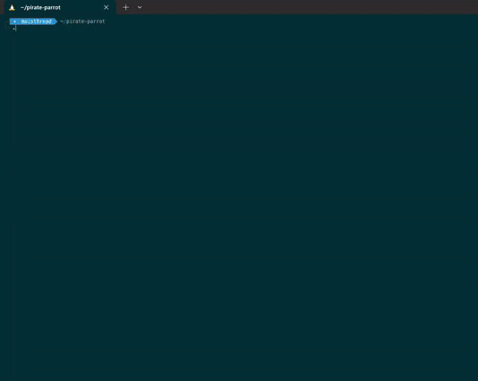

### pirate parrot

It's been requested of me by my crew members that I make a working `curl parrot.live` like but with a pirate side to him.

And what my crew wants is what they'll get!!

Low and behold the pirate parrot!!



Usage:
```bash
bash -c "$(curl -fsSL https://raw.githubusercontent.com/moist-bread/pirate-parrot/main/pirate.sh)" 
```

Have fun THE ORDER!!

Planned upgrades:
- making the usage into a shorter and simpler curl command